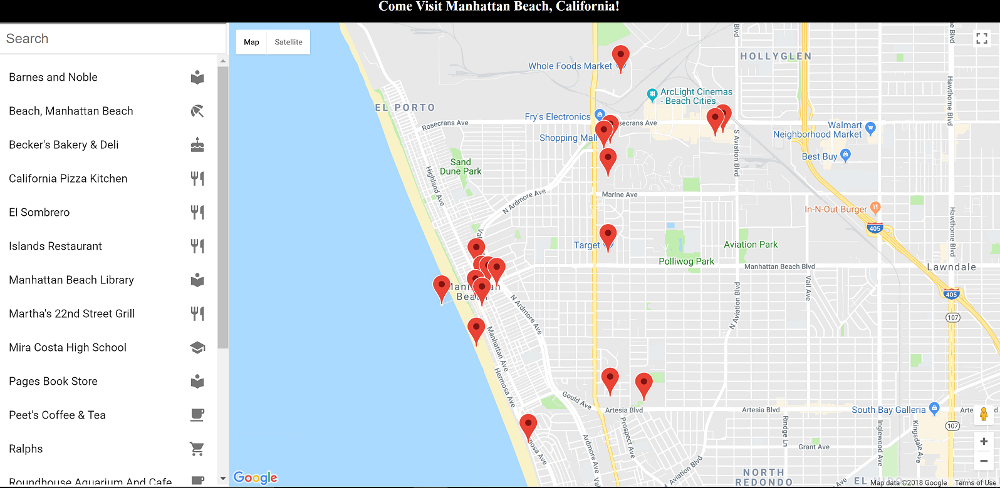

# Neighborhood Map

<p align="center">
  
</p>

This project includes a neighborhood map of [Manhattan Beach, California](http://www.citymb.info/) along with information about several venues there including local restaurants, ocean-related sites, and stores. The project was bootstrapped with [Create React App](https://github.com/facebookincubator/create-react-app) and developed using `React`. The map feature used in the application was obtained via `react-google-maps`, an application that integrates `React` with Google Maps. In turn, that software was itself based on [Google Maps API](https://developers.google.com/maps/). Documentation about `react-google-maps` can be found [here](https://github.com/tomchentw/react-google-maps). In addition, the street views for markers that were used were obtained with the [street view feature](https://developers.google.com/maps/documentation/javascript/streetview) of Google Maps, also through `react-google-maps`. Data about the included venues were extracted using the [Foursquare API](https://developer.foursquare.com/).

Users begin with a map of the neighborhood together with a list view of venues. A search feature allows the user to filter this list and upon clicking any item, the user is taken to the chosen venue's item page, detailing information about the location, hours of operation, busy times of the week and day, a photo view, contact information, customer tips, and more.

<p align="center">
  
</p>

Clicking on the corresponding marker on the map will open a street view of the premises. Markers on the map are filtered in accordance with the filtered query and will animate/bounce when the corresponding item is clicked. Additional features include error handling for failed API requests, responsive design for mobile devices, accessibility features for motor- and visually-impaired users in the form of controlled focus, ARIA roles, and alternate image text, and finally, a service worker to cache the data of visited pages in the event of a poor network connection.

<p align="center">
  
</p>

## Downloading The Project

* To download, you can clone the repository using this terminal command:
```
git clone https://github.com/wbchristerson/neighborhood-map.git
```

Alternatively, follow the instructions below to download to a hard drive:
* Click the green "Clone or download" button above then choose "Download ZIP".
* Find the folder `neighborhood-map-master` in your Downloads folder or wherever it was placed on your device.
* Right click and choose "Extract All".

* To install all dependencies for the project from the command line, run the following commands in the terminal:
    - `cd neighborhood-map`
    - `npm install`
* You will need a `Google Maps Platform` API key along with a `Foursquare Client ID` and a `Foursquare Client Secret` to use in the application. To do so:
    -If you do not have a Google Maps API key already, then you can obtain a `Google Maps Platform` API key for free [here](https://cloud.google.com/maps-platform/). You will have to create a billing account but there is a built in $200 credit.
    -If you do not have the `Foursquare Client ID` or `Foursquare Client Secret`, then you can obtain them [here](https://developer.foursquare.com/) by first creating a free account.
    -After you have all three data items, create a new folder in the `src` directory called `api`.
    -Within `api`, create a Javascript file called `APIkey.js`. Within this file add the following lines, where `YOUR_GOOGLE_KEY`, `YOUR_FOURSQUARE_CLIENT_ID`, and `YOUR_FOURSQUARE_CLIENT_SECRET` are replaced by your personalized data values (don't forget the delimiting quotes):
    ```
    export const GOOGLE_MAP_API_KEY = 'YOUR_GOOGLE_KEY'
    export const FOURSQUARE_CLIENT_ID = 'YOUR_FOURSQUARE_CLIENT_ID'
    export const FOURSQUARE_CLIENT_SECRET = 'YOUR_FOURSQUARE_CLIENT_SECRET'
    ```
    -Save the file.
* Assuming that your location in the terminal is now within the `neighborhood-map` directory, run the following command to execute the application:
    - `npm start`

(I believe that `yarn start` will also be sufficient.)
* Warning: The service worker that is bundled with `create-react-app` only works in production mode.

The page will open in the browser. You can get your own API keys for Google Maps and Foursquare on their developer websites.
